# TechScan Architecture & Flow Diagrams

## High-Level Architecture

```mermaid
flowchart TB
    subgraph Client["👤 Client Layer"]
        Browser["🌐 Web Browser"]
        API["📱 API Consumer"]
        Script["📜 Batch Script"]
    end

    subgraph Flask["🐍 Flask API Layer (Python 3.12)"]
        Scan["/scan - Single Scan"]
        Bulk["/bulk_scan - Batch Scan"]
        UI["/api/* - CRUD Operations"]
        Admin["/admin/* - Admin APIs"]
    end

    subgraph Engine["⚙️ Unified Scan Engine"]
        Heuristic["🔍 Heuristic Scanner\n(Fast: ~500ms)"]
        Wappalyzer["🔬 Wappalyzer Scanner\n(Deep: 5-30s)"]
        Merge["🔀 Merge & Enrich"]
    end

    subgraph Storage["💾 Data Layer"]
        Postgres[("🐘 PostgreSQL\nScans, Technologies")]
        Redis[("⚡ Redis\nCache, Rate Limits")]
        Wapp[("📚 Wappalyzer DB\n3000+ Tech Signatures")]
    end

    Client --> Flask
    Flask --> Engine
    Heuristic --> Merge
    Wappalyzer --> Merge
    Merge --> Storage
    Engine <--> Storage
```

---

## Scanning Strategy Flow

```mermaid
flowchart TD
    Start([🚀 Request: /scan?domain=example.com]) --> Preflight

    subgraph Preflight["Step 0: Preflight Check"]
        DNS["DNS Resolution"]
        TCP["TCP Connection Test"]
    end

    Preflight -->|Success| HeuristicScan
    Preflight -->|Fail| Error1[❌ Domain Unreachable]

    subgraph HeuristicScan["Step 1: Heuristic Fast Scan (~500ms)"]
        H1["Parse HTTP Headers\n(Server, X-Powered-By)"]
        H2["Analyze HTML Meta Tags"]
        H3["Match URL Patterns\n(/wp-admin, /laravel)"]
        H4["Detect Common JS/CSS"]
    end

    HeuristicScan --> Check1{Tech Count > 3?}
    
    Check1 -->|No| DeepScan
    Check1 -->|Yes| DeepScan

    subgraph DeepScan["Step 2: Wappalyzer Deep Scan (5-30s)"]
        D1["Launch Puppeteer Browser"]
        D2["Full Page Render"]
        D3["Execute JavaScript"]
        D4["Match 3000+ Signatures"]
        D5["Extract Versions"]
    end

    DeepScan --> MergeStep

    subgraph MergeStep["Step 3: Merge & Persist"]
        M1["Combine Both Results"]
        M2["Remove Duplicates"]
        M3["Resolve Version Conflicts"]
        M4["Version Audit Check"]
        M5["Save to PostgreSQL"]
    end

    MergeStep --> Response([✅ Return JSON Response])
```

---

## Component Interaction

---

## Weekly Rescan Flow

```mermaid
flowchart LR
    subgraph Scheduler["⏰ Scheduler"]
        Cron["Cron: Sunday 03:00"]
    end

    subgraph Selection["📋 Domain Selection"]
        Query["Query all domains\nfrom database"]
        Limit["Apply limit\n(max 2000)"]
    end

    subgraph Scanning["🔄 Batch Scan"]
        Pool["Concurrent Pool\n(3 workers)"]
        Scan1["Scan Domain 1"]
        Scan2["Scan Domain 2"]
        ScanN["Scan Domain N"]
    end

    subgraph Update["💾 Update"]
        Save["Save new results"]
        Log["Log completion"]
    end

    Cron --> Selection
    Selection --> Scanning
    Pool --> Scan1 & Scan2 & ScanN
    Scanning --> Update
```

---

## Cara Menggunakan Diagram Ini

### Option 1: GitHub README
Copy diagram ke README.md - GitHub akan render Mermaid otomatis.

### Option 2: VS Code
Install extension "Markdown Preview Mermaid Support"

### Option 3: Online Editor
Paste ke https://mermaid.live untuk preview dan export PNG/SVG

### Option 4: Notion
Paste code block dengan type "mermaid"

### Option 5: PowerPoint/Slides
1. Buka https://mermaid.live
2. Paste diagram
3. Export sebagai PNG/SVG
4. Insert ke slide
